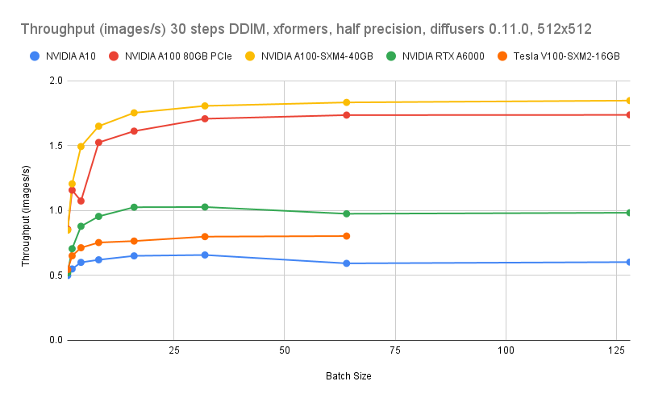

# Benchmark update

We are currently running benchmarks to update our Stable Diffusion numbers using a more recent version of Diffusers and to take advantage of xformers. THe interim results on a limited set of GPUs are presented here.

## Running the benchmark

Ensure that [NVIDIA container toolkit](https://docs.nvidia.com/datacenter/cloud-native/container-toolkit/install-guide.html) is installed on your system and then run the following:

```bash
git clone https://github.com/LambdaLabsML/lambda-diffusers.git
cd lambda-diffusers/scripts
make bench
```

Results will be written to `results.csv`, the benchmark will take different amounts of time depending on the GPU present but expect it to take at least several minutes.

## Results

The current results for the benchmark are available in [`benchmark.csv`](../benchmarks/benchmark.csv). These results were run with Diffusers 0.11.0 and xformers using Ubuntu 20.04, Python 3.8, PyTorch 1.13, CUDA 11.8 ([NGC PyTorch container 22.11](https://docs.nvidia.com/deeplearning/frameworks/pytorch-release-notes/rel-22-11.html)).

xformers provides a significant boost in performance and memory consumption allowing large batch sizes to maximise utilisation of GPUs. Our best performance comes using NVIDIA A100-SXM4-40GB on [Lambda GPU cloud](https://cloud.lambdalabs.com), at the maximum batch size tested (128) at half precision we observe a throughput of 1.85 images/second when using DDIM 30 steps for sampling.

