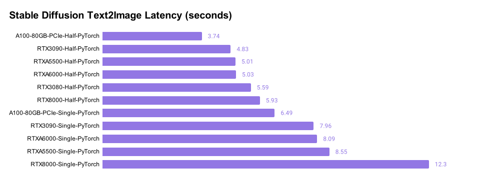
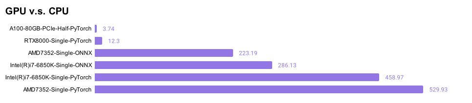
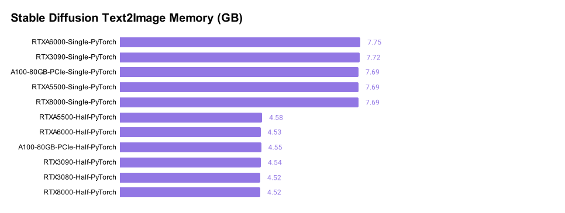
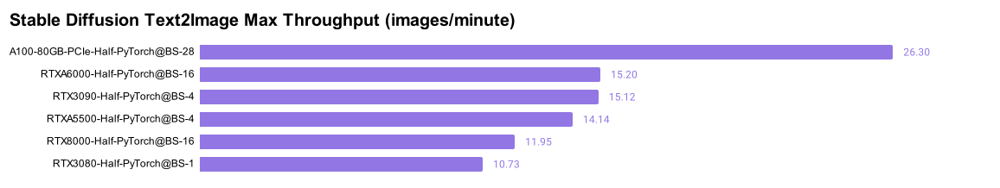
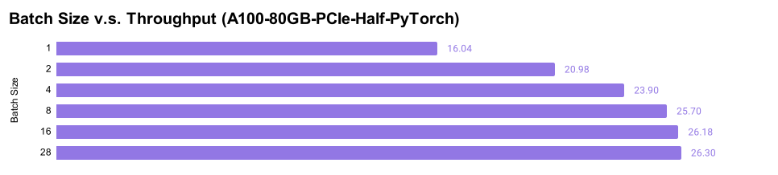

# Benchmarking Diffuser Models

We benchmark [Stable Diffusion](https://huggingface.co/CompVis/stable-diffusion) model inference using different GPUs and CPUs. When possible, we use half-precision and onnxruntime to speed up the inference. The input is a text prompt, and the output is an image of resolution `512x512`.

## Latency

The figure below shows the latency of running inference using a single text prompt "a photo of an astronaut riding a horse on mars". The key insights are:
* The inference latencies range between `3.74` to `5.56` seconds across our tested Ampere GPUs, including the consumer 3080 card to the flagship A100 80GB card.
* Half-precision reduces the latency by about `40%` for Ampere GPUs, and by `52%` for the previous generation `RTX8000` GPU. We believe Ampere GPUs enjoy a relatively "smaller" speedup from half-precision due to their use of `TF32`. For readers who are not familiar with `TF32`, it is a [`19-bit` format](https://blogs.nvidia.com/blog/2020/05/14/tensorfloat-32-precision-format/) that has been used as the default single-precision data type on Ampere GPUs for major deep learning frameworks such as PyTorch and TensorFlow. One can expect half-precision's speedup over `FP32` to be bigger since it is a true `32-bit` format.




Putting such performance in the context of the performance of running the same inference job on CPUs (the figure below), we notice that:
* GPUs are significantly faster -- by one or two orders of magnitudes depending on the precisions. 
* `onnxruntime` can reduce the latency for CPU by about `40%` to `50%`, depending on the type of CPUs.
* ONNX currently does not have [stable support](https://github.com/huggingface/diffusers/issues/489) for Huggingface diffusers. We will investigate `onnxruntime-gpu` in future benchmarks.




## Memory

We also measure the memory consumption of running stable diffusion inference, and here are the results:
* It takes about `7.7 GB` GPU memory to run single-precision inference with batch size one. This is consistent across all tested GPUs.
* It takes about `4.5 GB` GPU memory to run half-precision inference with batch size one. This is consistent across all tested GPUs.




## Throughput

Latency measures how quickly a _single_ input can be processed, which is critical to online applications that don't tolerate even the slightest delay. However, some (offline) applications may focus on "throughput", which measures the total volume of data processed in a fixed amount of time. 

Our throughput benchmark pushes the batch size to the maximum for each GPU, and measures the number of images they can process per minute. The reason for maximizing the batch size is to keep tensor cores busy so that computation can dominate the workload, avoiding any non-computational bottlenecks.

* Once again, A100 80GB has the highest throughput. In the meantime, the gap between A100 80GB and other cards are enlarged due to the largest batch size that can be used on this card. 




As a concrete example, the chart below shows how A100 80GB's throughput increases by `64%` when we changed the batch size from 1 to 28 (the largest without causing an out of memory error). It is also interesting to see that the increase is not linear and flattens out when batch size reaches a certain value, at which point the tensor cores on the GPU are saturated and any new data in the GPU memory will have to be queued up before getting their own computing resources. 




## Precision

We are curious about whether half-precision introduces degradations to the quality of the output images. To test this out, we fixed the text prompt as well as the "latent" input vector and fed them to the single-precision model and the half-precision model. We ran the inference for 100 steps and saved both models' outputs at each step, as well as the difference map:


Our observation is that there are indeed visible differences between the single-precision output and the half-precision output, especially in the early steps. The differences often decrease with the number of steps, but might not always vanish. 

Interestingly, such a difference may not imply artifacts in half-precision's outputs. For example, in step 70, the picture below shows half-precision didn't produce the artifact in the single-precision output (an extra front leg):


# Reproduce

You can use this [Lambda Diffusers](https://github.com/LambdaLabsML/lambda-diffusers) repo to reproduce the results.

## Setup

Before running the benchmark, make sure you have completed the repository [installation steps](../README.md#installation).

You will then need to set the huggingface access token:
1. Create a user account on HuggingFace and generate an access token.
2. Set your huggingface access token as the `ACCESS_TOKEN` environment variable:
```
export ACCESS_TOKEN=<hf_...>
```

## Usage

Launch the `benchmark.py` script to append benchmark results to the existing [benchmark.csv](../benchmark.csv) results file:
```
python ./scripts/benchmark.py
```

Lauch the `benchmark_quality.py` script to compare the output of single-precision and half-precision models:
```
python ./scripts/benchmark_quality.py
```