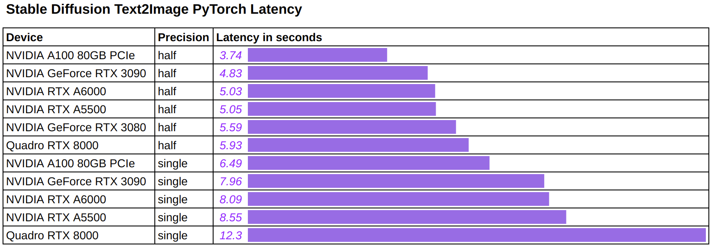
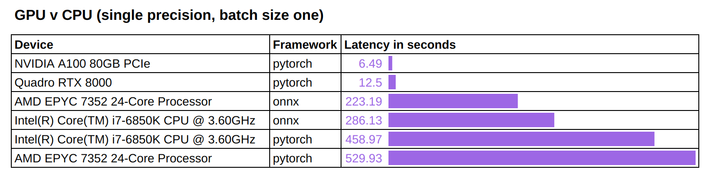
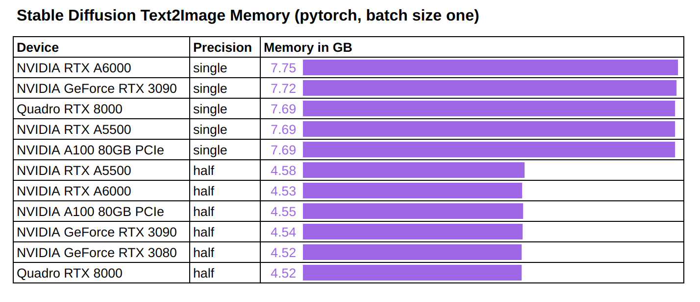
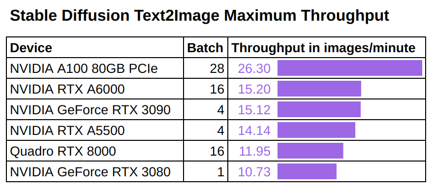
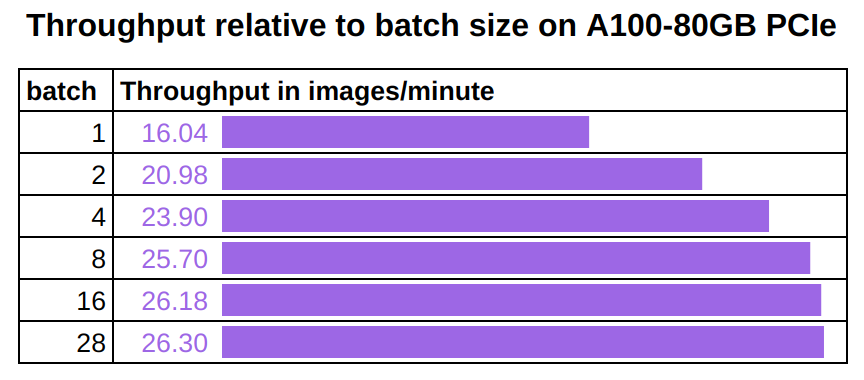
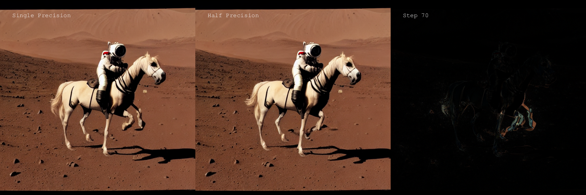

# Benchmarking Diffuser Models

__We are currently in the process of updating our Stable Diffusion benchmark using more recent version of Diffusers and taking advantage of xformers. See the summary of interim result [here](./benchmark-update.md)__

We present a benchmark of [Stable Diffusion](https://huggingface.co/CompVis/stable-diffusion) model inference.  This text2image model uses a text prompt as input and outputs an image of resolution `512x512`.

Our experiments analyze inference performance in terms of speed, memory consumption, throughput, and quality of the output images. We look at how different choices in hardware (GPU model, GPU vs CPU) and software (single vs half precision, pytorch vs onnxruntime) affect inference performance.

For reference, we will be providing benchmark results for the following GPU devices: A100 80GB PCIe, RTX3090, RTXA5500, RTXA6000, RTX3080, RTX8000. Please refer to the ["Reproducing the experiments"](#reproducing-the-experiments) section for details on running these experiments in your own environment.


## Inference speed

The figure below shows the latency at inference when using different hardware and precision for generating a single image using the (arbitrary) text prompt: *"a photo of an astronaut riding a horse on mars"*.




We find that:
* The inference latencies range between `3.74` to `5.56` seconds across our tested Ampere GPUs, including the consumer 3080 card to the flagship A100 80GB card.
* Half-precision reduces the latency by about `40%` for Ampere GPUs, and by `52%` for the previous generation `RTX8000` GPU.

We believe Ampere GPUs enjoy a relatively "smaller" speedup from half-precision due to their use of `TF32`. For readers who are not familiar with `TF32`, it is a [`19-bit` format](https://blogs.nvidia.com/blog/2020/05/14/tensorfloat-32-precision-format/) that has been used as the default single-precision data type on Ampere GPUs for major deep learning frameworks such as PyTorch and TensorFlow. One can expect half-precision's speedup over `FP32` to be bigger since it is a true `32-bit` format.


We run these same inference jobs CPU devices to put in perspective the inference speed performance observed on GPU.




We note that:
* GPUs are significantly faster -- by one or two orders of magnitudes depending on the precisions.
* `onnxruntime` can reduce the latency for CPU by about `40%` to `50%`, depending on the type of CPUs.

ONNX currently does not have [stable support](https://github.com/huggingface/diffusers/issues/489) for Huggingface diffusers.
We will investigate `onnxruntime-gpu` in future benchmarks.


## Memory

We also measure the memory consumption of running stable diffusion inference.



Memory usage is observed to be consistent across all tested GPUs:
* It takes about `7.7 GB` GPU memory to run single-precision inference with batch size one.
* It takes about `4.5 GB` GPU memory to run half-precision inference with batch size one.


## Throughput

Latency measures how quickly a _single_ input can be processed, which is critical to online applications that don't tolerate even the slightest delay. However, some (offline) applications may focus on "throughput", which measures the total volume of data processed in a fixed amount of time.


Our throughput benchmark pushes the batch size to the maximum for each GPU, and measures the number of images they can process per minute. The reason for maximizing the batch size is to keep tensor cores busy so that computation can dominate the workload, avoiding any non-computational bottlenecks.

We run a series of throughput experiment in pytorch with half-precision and using the maximum batch size that can be used for each GPU:



We note:
* Once again, A100 80GB is the top performer and has the highest throughput.
* The gap between A100 80GB and other cards in terms of throughput can be explained by the larger maximum batch size that can be used on this card.


As a concrete example, the chart below shows how A100 80GB's throughput increases by `64%` when we changed the batch size from 1 to 28 (the largest without causing an out of memory error). It is also interesting to see that the increase is not linear and flattens out when batch size reaches a certain value, at which point the tensor cores on the GPU are saturated and any new data in the GPU memory will have to be queued up before getting their own computing resources.




## Precision

We are curious about whether half-precision introduces degradations to the quality of the output images. To test this out, we fixed the text prompt as well as the "latent" input vector and fed them to the single-precision model and the half-precision model. We ran the inference for 100 steps and saved both models' outputs at each step, as well as the difference map:


Our observation is that there are indeed visible differences between the single-precision output and the half-precision output, especially in the early steps. The differences often decrease with the number of steps, but might not always vanish.

Interestingly, such a difference may not imply artifacts in half-precision's outputs. For example, in step 70, the picture below shows half-precision didn't produce the artifact in the single-precision output (an extra front leg):



---

## Reproducing the experiments

You can use this [Lambda Diffusers](https://github.com/LambdaLabsML/lambda-diffusers) repository to reproduce the results presented in this article.

### From your local machine

#### Setup

Before running the benchmark, make sure you have completed the repository [installation steps](../README.md#installation).

You will then need to set the huggingface access token:
1. Create a user account on HuggingFace and generate an access token.
2. Set your huggingface access token as the `ACCESS_TOKEN` environment variable:
```
export ACCESS_TOKEN=<hf_...>
```

#### Usage

Launch the `benchmark.py` script to append benchmark results to the existing [benchmark.csv](../benchmark.csv) results file:
```
python ./scripts/benchmark.py
```

Lauch the `benchmark_quality.py` script to compare the output of single-precision and half-precision models:
```
python ./scripts/benchmark_quality.py
```


### From a docker container

The following instructions show how to run the benchmarking program from a docker container on Ubuntu.

#### Prerequisites

#### Get a huggingface access token

Create a huggingface account.
Get a [huggingface access token](https://huggingface.co/docs/hub/security-tokens).

#### Install NVIDIA docker

This section can be skipped if the environment already uses [Lambda Stack](https://lambdalabs.com/lambda-stack-deep-learning-software) or if the experiments are running on a [Lambda cloud](https://lambdalabs.com/service/gpu-cloud) instance as docker and `nvidia-container-toolkit` comes pre-installed in these cases.

We first install docker:
```
# Install
sudo apt-get update
sudo apt-get remove docker docker-engine docker.io -y
sudo apt install containerd -y
sudo apt install docker.io -y
sudo systemctl start docker
sudo systemctl enable docker
# Test install
docker --version
# Put the user in the docker group
sudo usermod -a -G docker $USER
newgrp docker
```

We install requirements to run docker containers leveraging NVIDIA GPUs:
```
# Install
sudo apt install curl
distribution=$(. /etc/os-release;echo $ID$VERSION_ID)
curl -s -L https://nvidia.github.io/nvidia-docker/gpgkey | sudo apt-key add -
curl -s -L https://nvidia.github.io/nvidia-docker/$distribution/nvidia-docker.list | sudo tee /etc/apt/sources.list.d/nvidia-docker.list
sudo apt-get update && sudo apt-get install -y nvidia-container-toolkit
sudo systemctl restart docker
# Test install
sudo docker run --rm --gpus all nvidia/cuda:11.2.1-base-ubuntu20.04 nvidia-smi
```


3. Build the benchmark docker image

```
docker build -t benchmark -f ./benchmarking/Dockerfile .
```

#### Running the benchmark

Set the HuggingFace access token as environment variable:
```
export ACCESS_TOKEN=<your-hugging-face-access-token-here>
```

Run the benchmark program from the container and export the output `.csv` file to the host:
```
containerid=$(docker run --gpus all -e ACCESS_TOKEN=${ACCESS_TOKEN} -d --entrypoint "python3" benchmark:latest scripts/benchmark.py --samples=1,2,4,8,16) && \
docker wait ${containerid} && \
docker cp ${containerid}:/lambda_diffusers/benchmark_tmp.csv ./benchmark_tmp.csv
```

*Note that the arguments `scripts/benchmark.py --samples=1,2,4,8,16` can be changed to point to a different script or use different arguments.*